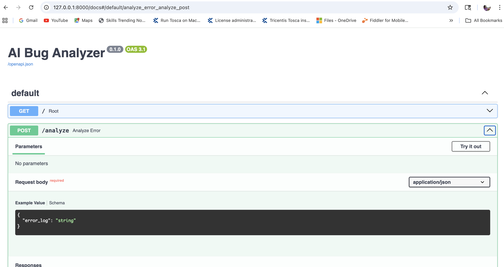

# AI Bug Analyzer (LLM + RAG + FAISS)

AI-powered system that analyzes software test failures and suggests root causes and fixes using Large Language Models and Retrieval-Augmented Generation.

## Features

- Semantic log search using embeddings
- Vector database using FAISS
- LLM-powered root cause analysis
- FastAPI service
- Interactive CLI tool

## Architecture

Logs → Embeddings → Vector DB → LLM → Root cause analysis

## Installation
pip install -r requirements.txt

## Run CLI
python -m src.main

## Run API
uvicorn src.api.server:app --reload

## Example
Input :
Submit button not visible
Output :
Root Cause: element hidden or not loaded
Suggested fix: add explicit wait

## Demo

## Author

Mahesh Desu  
AI Engineer Portfolio Project